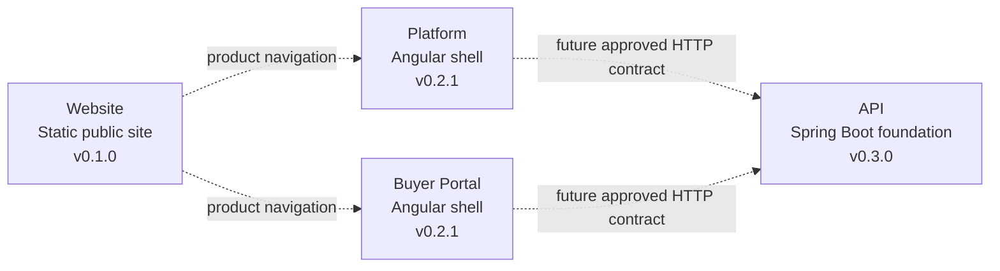
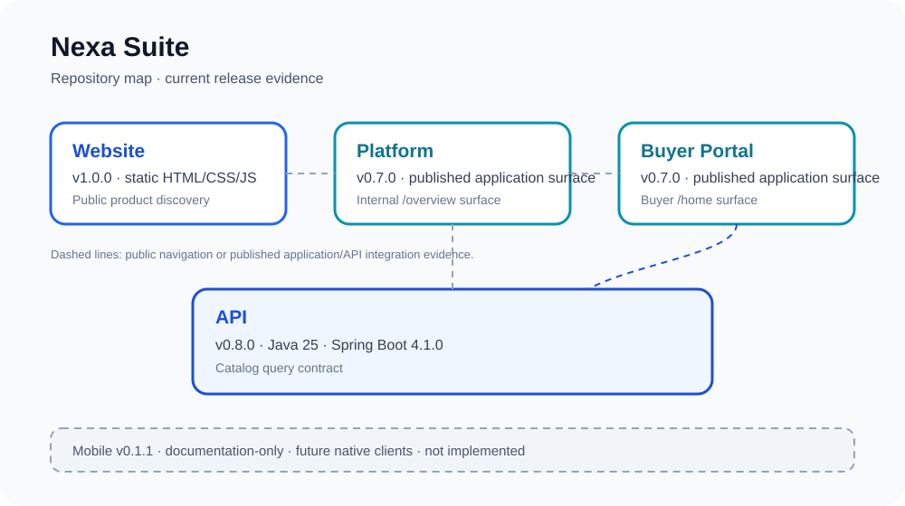

<div align="center">


# Nexa Mobile

Repository reserved for future native Nexa buyer and cold-chain field-operation clients.

[](https://github.com/nexa-suite/mobile) [](https://github.com/nexa-suite/mobile/releases/tag/v0.1.0)

[Changelog](./CHANGELOG.md) · [Release notes](./docs/releases/) · [Contributing](./.github/CONTRIBUTING.md) · [Security](./.github/SECURITY.md)

**Current repository:** Mobile · **Current release:** `v0.1.0`

[Website](https://github.com/nexa-suite/website) · [Platform](https://github.com/nexa-suite/platform) · [Portal](https://github.com/nexa-suite/portal) · [API](https://github.com/nexa-suite/api) · [Mobile](https://github.com/nexa-suite/mobile)

</div>

---

## Current status

`v0.1.0` is a documentation-only repository foundation. No Android, iOS, Kotlin Multiplatform, Flutter or SwiftUI application is implemented, and no mobile build or runtime command exists.

## Product boundaries



Mobile is deliberately absent from the implemented runtime. Its future clients will consume approved API contracts and keep client models separate from backend domain code. PostgreSQL, AI, IoT and cloud services are outside this repository foundation.



## Repository map

| Repository | Current release | Responsibility | Evidence status |
|---|---:|---|---|
| [Website](https://github.com/nexa-suite/website) | `v0.1.0` | Static public product discovery | Released static site |
| [Platform](https://github.com/nexa-suite/platform) | `v0.2.1` | Internal operations shell | Angular shell |
| [Portal](https://github.com/nexa-suite/portal) | `v0.2.1` | Buyer self-service shell | Angular shell |
| [API](https://github.com/nexa-suite/api) | `v0.3.0` | Business and integration authority | Catalog domain foundation |
| **Mobile** | **`v0.1.0`** | Future native clients | Documentation-only |

## Planned boundary

- Future native buyer and field-operation clients.
- Future Warehouse, Logistics and Dispatch workflows.
- Kotlin and SwiftUI remain options; no technology has been selected.
- API authorization and domain rules remain owned by the backend bounded contexts.
- Client code must not become a second business authority.

## Tech stack

No mobile technology is selected for implementation. Flutter is not an implementation decision in this repository.

## Getting started

No application setup, dependency installation or runtime command is provided. This repository contains documentation and release guidance only.

## Project structure

```text
README.md
CHANGELOG.md
docs/assets/nexa.svg
docs/assets/repository-map/nexa-suite-map.svg
docs/releases/
.github/
```

## Documentation

- [Release notes index](./docs/releases/)
- [Release policy](./.github/RELEASE_POLICY.md)

## Next decision gate

Before creating a client project, approve ownership, target workflows, API contracts, identity and tenant boundaries, offline requirements and device validation. Do not infer implementation from this repository's roadmap.
