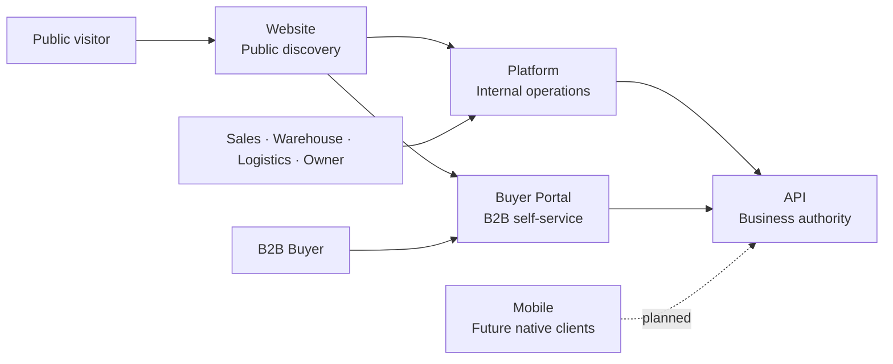

<div align="center">


# Nexa Mobile

Repository reserved for future native Nexa mobile clients and cold-chain field-operation experiences.

[](https://github.com/nexa-suite/mobile) [](https://github.com/nexa-suite/mobile) [](https://github.com/nexa-suite/mobile/releases/tag/v0.1.0) [](https://github.com/nexa-suite/mobile/releases/latest)

[Latest Release](https://github.com/nexa-suite/mobile/releases/latest) · [Changelog](./CHANGELOG.md) · [Contributing](./.github/CONTRIBUTING.md) · [Security](./.github/SECURITY.md)

**Current repository:** Mobile

[Website](https://github.com/nexa-suite/website) · [Platform](https://github.com/nexa-suite/platform) · [Portal](https://github.com/nexa-suite/portal) · [API](https://github.com/nexa-suite/api) · [Mobile](https://github.com/nexa-suite/mobile)

</div>

## Overview

Nexa Mobile is one product repository reserved for future native buyer and field-operation clients. No client application has been released.

## Nexa Suite Architecture



## Repository Map

<table>
  <tr>
    <td width="50%"><h3>Website</h3><p>Public commercial discovery entry point.</p><p>Repository foundation · v0.1.0.</p><p><a href="https://github.com/nexa-suite/website">Repository</a></p></td>
    <td width="50%"><h3>Platform</h3><p>Internal operations for Sales, Warehouse, Logistics, Company Ownership and Administration.</p><p>Angular · v0.2.1.</p><p><a href="https://github.com/nexa-suite/platform">Repository</a></p></td>
  </tr>
  <tr>
    <td width="50%"><h3>Buyer Portal</h3><p>Buyer-facing catalog, requests, orders and delivery visibility.</p><p>Angular · v0.2.1.</p><p><a href="https://github.com/nexa-suite/portal">Repository</a></p></td>
    <td width="50%"><h3>API</h3><p>Business and integration authority.</p><p>Java 26 / Spring Boot 4.1 · v0.3.0.</p><p><a href="https://github.com/nexa-suite/api">Repository</a></p></td>
  </tr>
  <tr>
    <td width="50%"><h3><b>Mobile</b></h3><p>Future native buyer and field-operation clients.</p><p>Planned · v0.1.0.</p><p><a href="https://github.com/nexa-suite/mobile">Current repository</a></p></td>
    <td width="50%"></td>
  </tr>
</table>

## Role in the Ecosystem

Mobile will consume API contracts shared with web clients. It will not share Java backend domain code or bypass API authorization.

## Scope

- One product repository for future native clients.
- Planned Kotlin and SwiftUI implementations.
- Future buyer, Warehouse, Logistics, Dispatch and cold-chain field operations.
- No Flutter decision has been made.
- No Android, iOS or cross-platform project exists in this release.

## Architecture

Future clients will map explicit API contracts to client-owned models. Domain rules remain owned by API bounded contexts; client code will not become a second business authority.

## Tech Stack

Kotlin and SwiftUI are planned options. No mobile technology has been selected for implementation.

## Getting Started

No application setup or runtime command is provided. This release contains repository documentation only.

## Available Commands

There is no application build or runtime command in this repository foundation.

## Project Structure

```text
README.md
CHANGELOG.md
docs/assets/nexa.svg
docs/releases/
.github/
```

## Documentation

- [Release notes](./docs/releases/)
- [Release policy](./.github/RELEASE_POLICY.md)

## Current Release

v0.1.0 is a repository documentation foundation. No runtime implementation has been released.

## Roadmap

Define native client ownership, select implementation technology, map approved API contracts and validate field workflows before creating a project.
